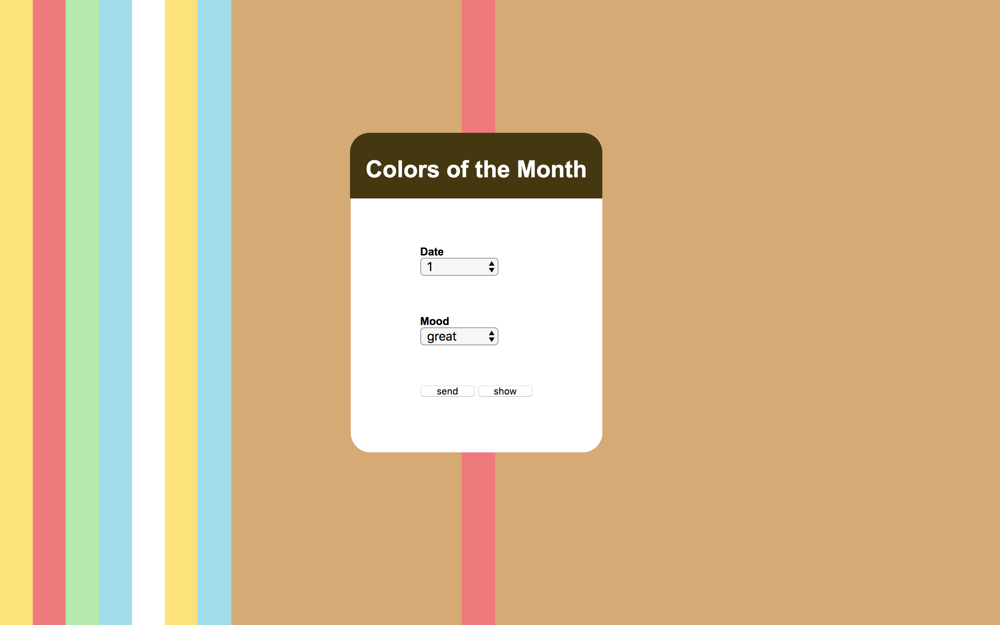
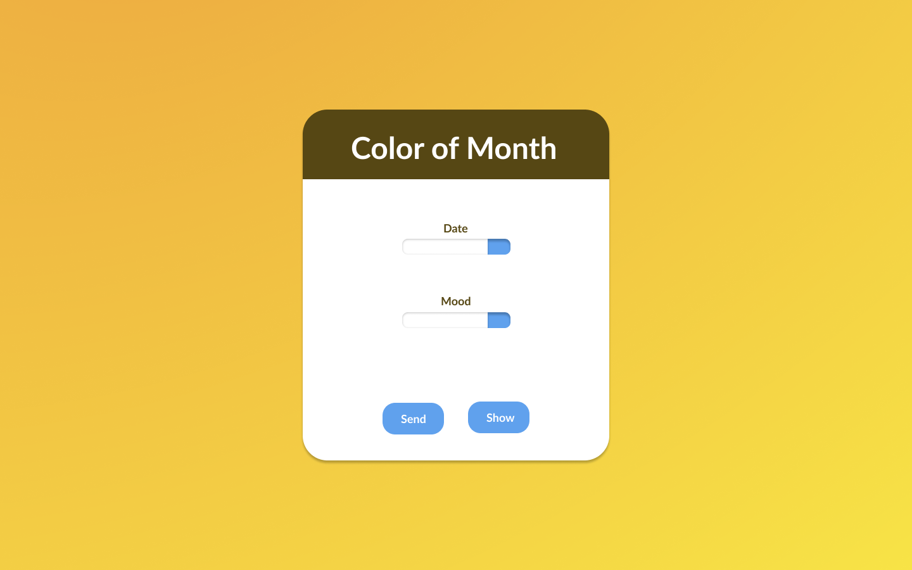
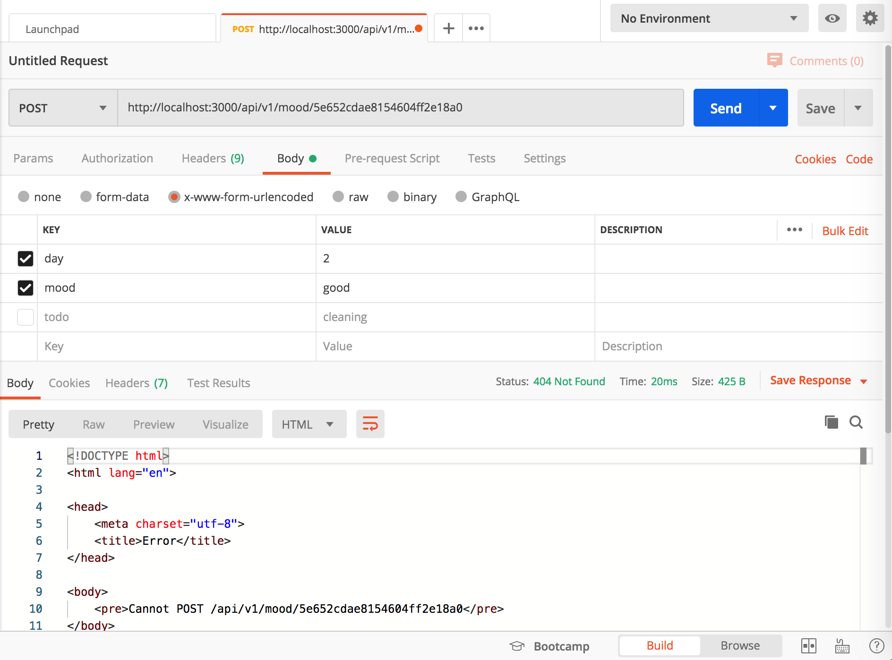

# Colors of the month
Colors of the month is a tool for people to document their emotion of days in a month, as a reminder to highlight the importance of mental health and self consciousness.
This week, I want to build a monthly mood graph that help myself be more aware of my mental health. So I use data to collect the mood I am in everyday, then transform it into color pattern.

## Design
I first design the visual in Figma, because this piece focus more on the color "gradient" in the background, so I decided not to add too much stuff on the interface, just with the essential material.

## Development
At first I rebuilt the back-end and database like we did in class, then I found out MongoDB Atlas can only host one free cluster. Because I still want to use it as my database, so I took the example Joey show in class and adapted it into my own version. After finish it, I tested my database with Postman first to make sure it went well.

For the Front-end, because there are two many select option elements in the html file, it's a bit hard to figure out the relationship between layers. Hopefully I use simple flex to adjust the alignment of card elements. As for the background, I use z-index to make it hide behind the card. In this project, I use get and post to show the color pattern in the data, and put the data into database by a click.
